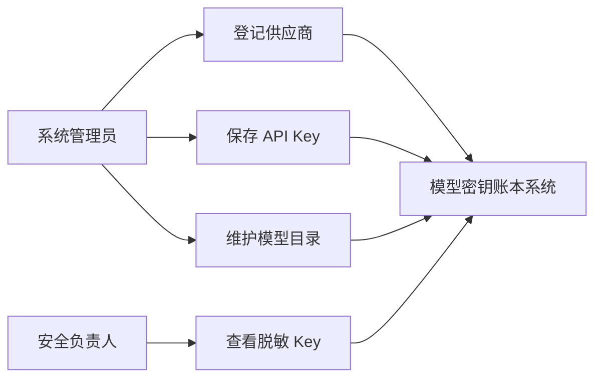
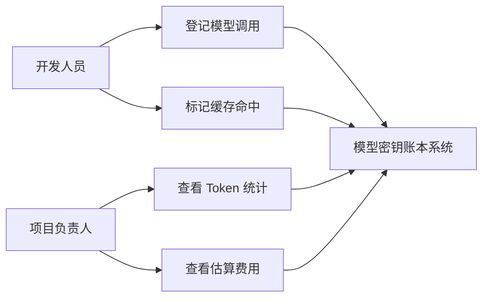
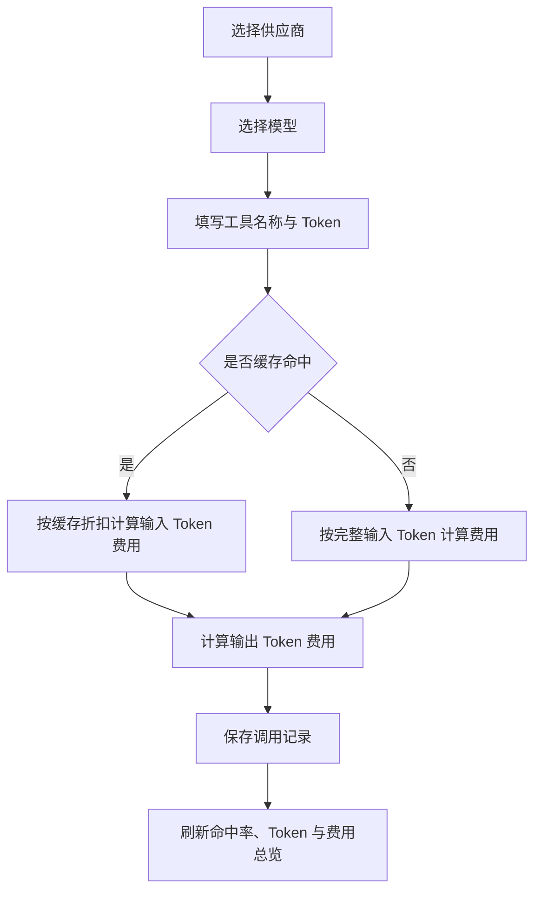
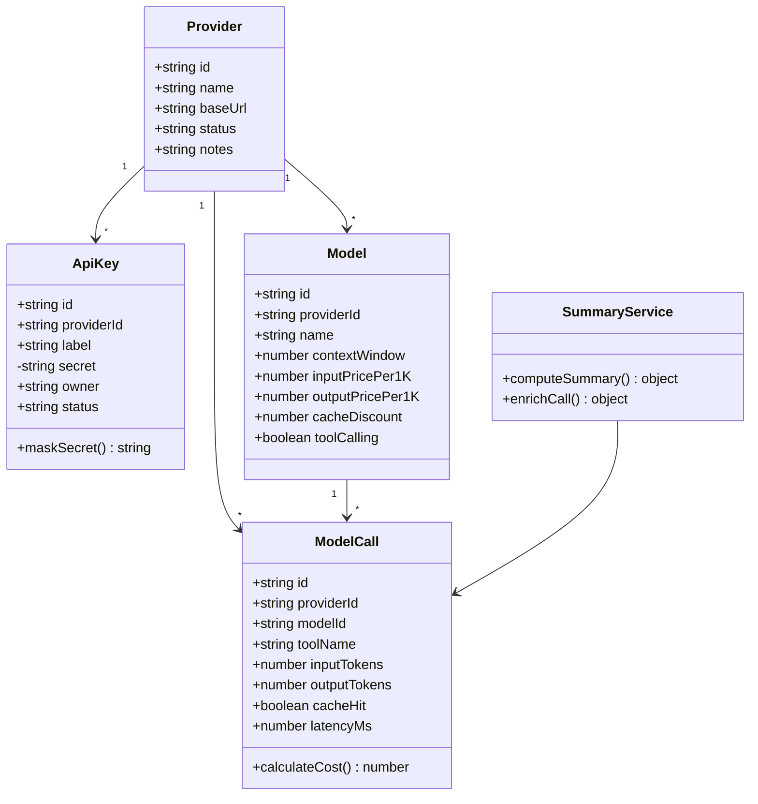
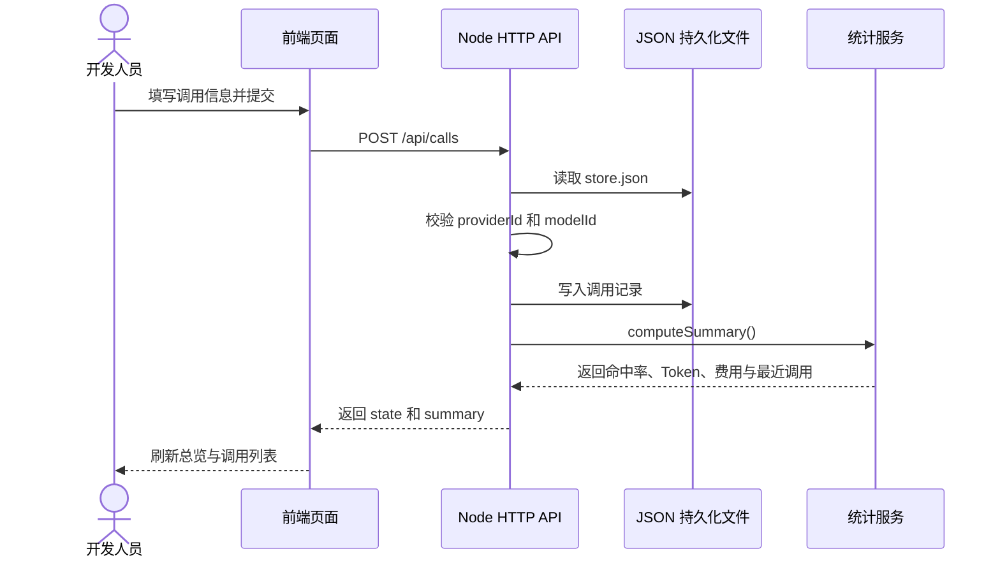

# 软件建模

本目录下 `docs/diagrams/` 已拆分出可独立导入或截图的 Mermaid 建模文件:

- `use-case-key-model.mmd`: API Key 与模型目录管理用例图
- `use-case-usage-billing.mmd`: 调用登记与成本查看用例图
- `class-diagram.mmd`: 核心类图
- `activity-call-billing.mmd`: 调用登记与计费活动图
- `sequence-create-call.mmd`: 新增调用记录顺序图

## 用例图: API Key 与模型目录管理

## 用例图: 调用登记与成本查看

## 活动图: 模型调用登记与计费

## 类图

## 顺序图: 新增调用记录

